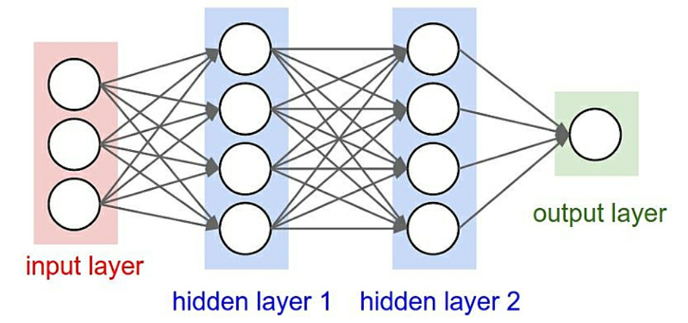

In this project you will implement a simple two-layer Neural Network, along with
its training algorithm based on back-propagation. This project has two parts: 

1. Implementation of a fully-connected Neural Network (NN) by using only basic
   matrix operations,

2. Implementation of NN by using pytorch functions.

This NN will be employed to classify the 10 object classes present in the
popular CIFAR-10 dataset, that you will use as a benchmark. This dataset
consists of 50k training colour images of 32x32 resolution with 10 object
classes, namely aeroplanes, cars, birds, cats, deer, dogs, frogs, horses, ships,
and lorries.

## 1. Neural Network implementation from scratch

In this first section you will be testing your results with the file
`cw_nn.py`, which invokes the functions of your NN and compares its results with
the expected ones. Your code implementing the architecture of the NN should be
written in `simple_nn.py` in the indicated sections.  

{width=90%}

The architecture of the NN is shown in figure \ref{nn}. It has an input layer,
two hidden layers and an output layer. Before training the model with CIFAR-10,
you might want first implement all the steps using random data to facilitate
debugging your code.

In this first stage of the implementation the NN receives an input
$X\in\mathbb{R}^{4}$, which is directed to the first layer of the NN, with 10
neurons, via a linear weighting matrix $W_{1} \in\mathbb{R}^{10x4}$ and the bias
term $b_{1} \in\mathbb{R}^{10}$. In this layer a linear operation is performed,

\begin{equation}
z_{2}=W_{1}X+b_{1}
\end{equation}

resulting in a 10-dimensional vector $z_{2}$. This operation is followed by
a ReLU non-linear activation $\phi$, applied element-wise on each neuron, which
yields the activations $a_{2}=\phi(z_{2})$ according to the definition of
$\phi$:

\begin{equation}
\phi(x) = \begin{cases} 
          0 & x < 0 \\
          x & x \geq 0 
       \end{cases}
\end{equation}

The result $a_{2}$ is then processed by the second hidden layer, composed of 10
neurons as well. Here $a_{2}$ is multiplied by $W_{2} \in\mathbb{R}^{3x10}$ and
the bias term $b_{2} \in\mathbb{R}^{3}$. In this layer the operation performed
is

\begin{equation}
z_{3}=W_{2}a_{2}+b_{2}
\end{equation}

Finally, the output of this layer $z_{3}$ goes through the output layer, where
a sigmoid activation $\psi$ function is applied element-wise, yielding the final
output of the NN:

\begin{equation}
\psi(z_{i})= \frac{e^{z_{i}}}{\sum_{j}{e^{z_{j}}}}
\end{equation}

The goal of this project is to develop the implementation of all the steps for
this architecture. Specifically: 

- Implement the feed-forward model of a two-layered NN architecture as well as
  the loss function to train it.
- Implement the back-propagation algorithm for this NN
- Train the model for toy random data using SGD
- Train the model for real data from the CIFAR-10 dataset using SGD and learning
  rate decay schedules.
- Improve the model training with better hyperparameters
- Optionally, add new techniques to further improve the performance of the NN.

## 2. Neural Network implementation with pytorch

In this section you will make use of the pytorch library to implement the
same NN as before. You will then add more layers and adjustments to the
hyperparameters to improve the performance of the NN. 

Specifically: 

- Implement the forward-pass, loss, gradient computation and optimisation steps
  with pytorch functions.
- Add more layers to the NN (up to 5) and tune the hyperparameters to improve
  its performance.

An important aspect of this work will be to make the most of python
vectorisation in your code. 

At the end of this week you will give a presentation in which you explain your
choices when training and optimising the NN. This presentation may also include
the relevant plots of the loss, training and validation performance, etc, as
well as a discussion of your results.   
